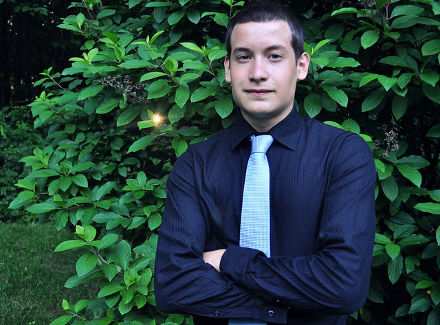
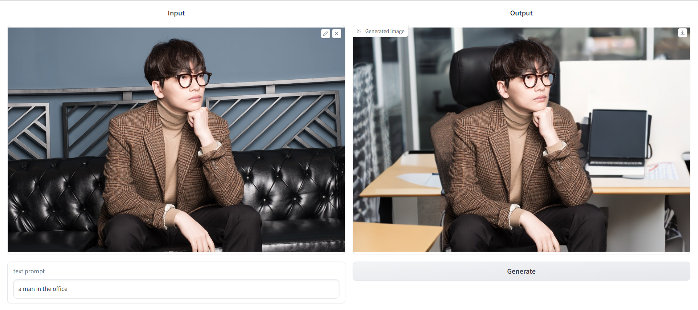

# Tobigs19_vision_conference

prompt: a man in office


## Installation
1. please download segment anything pretrain model at https://github.com/facebookresearch/segment-anything
2. please download yolov7 pretrain model at https://github.com/WongKinYiu/yolov7
3. <pre><code>pip install -r requirements.txt</code></pre>

## Getting Started
<pre><code>python main.py --input_img <your test image path> --text_prompt <your text prompt></code></pre>

## Gradio demo
- Demo UI built with gradio

```
python app_gradio.py
```
- To generate a public link, add ```--public_link```
- To use postprocessing, add ```--postprocessing```
